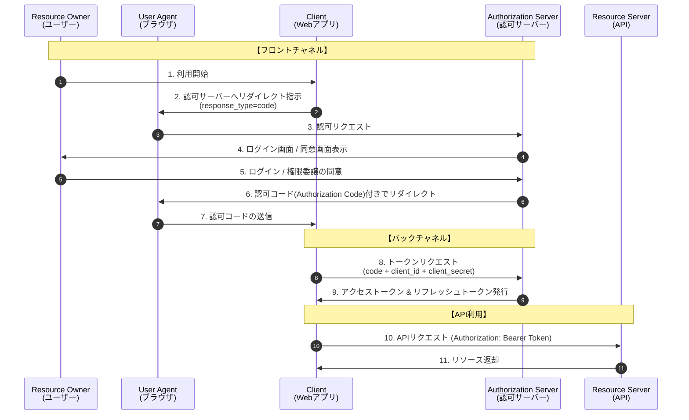
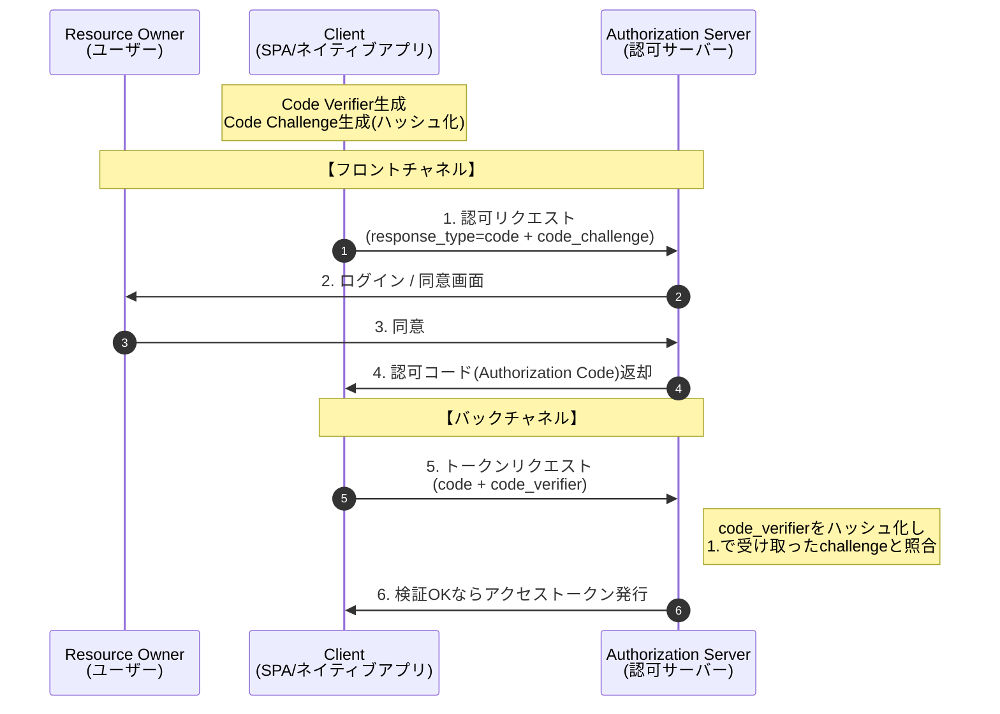

## 認可コードフロー

```mermaid
sequenceDiagram
    autonumber
    participant RO as Resource Owner<br>(ユーザー)
    participant UA as User Agent<br>(ブラウザ)
    participant Client as Client<br>(Webアプリ)
    participant AS as Authorization Server<br>(認可サーバー)
    participant RS as Resource Server<br>(API)

    Note over RO, AS: 【フロントチャネル】
    RO->>Client: 1. 利用開始
    Client->>UA: 2. 認可サーバーへリダイレクト指示<br>(response_type=code)
    UA->>AS: 3. 認可リクエスト
    AS->>RO: 4. ログイン画面 / 同意画面表示
    RO->>AS: 5. ログイン / 権限委譲の同意
    AS->>UA: 6. 認可コード(Authorization Code)付きでリダイレクト
    UA->>Client: 7. 認可コードの送信

    Note over Client, AS: 【バックチャネル】
    Client->>AS: 8. トークンリクエスト<br>(code + client_id + client_secret)
    AS->>Client: 9. アクセストークン & リフレッシュトークン発行

    Note over Client, RS: 【API利用】
    Client->>RS: 10. APIリクエスト (Authorization: Bearer Token)
    RS->>Client: 11. リソース返却
```

## 認可コードフロー + PKCE

```mermaid
sequenceDiagram
    autonumber
    participant RO as Resource Owner<br>(ユーザー)
    participant Client as Client<br>(SPA/ネイティブアプリ)
    participant AS as Authorization Server<br>(認可サーバー)

    Note over Client: Code Verifier生成<br>Code Challenge生成(ハッシュ化)

    Note over RO, AS: 【フロントチャネル】
    Client->>AS: 1. 認可リクエスト<br>(response_type=code + code_challenge)
    AS->>RO: 2. ログイン / 同意画面
    RO->>AS: 3. 同意
    AS->>Client: 4. 認可コード(Authorization Code)返却

    Note over Client, AS: 【バックチャネル】
    Client->>AS: 5. トークンリクエスト<br>(code + code_verifier)
    Note right of AS: code_verifierをハッシュ化し<br>1.で受け取ったchallengeと照合
    AS->>Client: 6. 検証OKならアクセストークン発行
```

## 参照リンク

-
