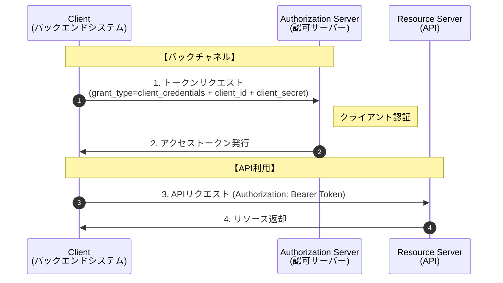

## フロー

```mermaid
sequenceDiagram
    autonumber
    participant Client as Client<br>(バックエンドシステム)
    participant AS as Authorization Server<br>(認可サーバー)
    participant RS as Resource Server<br>(API)

    Note over Client, AS: 【バックチャネル】
    Client->>AS: 1. トークンリクエスト<br>(grant_type=client_credentials + client_id + client_secret)
    Note right of AS: クライアント認証
    AS->>Client: 2. アクセストークン発行

    Note over Client, RS: 【API利用】
    Client->>RS: 3. APIリクエスト (Authorization: Bearer Token)
    RS->>Client: 4. リソース返却
```

## 参照リンク
- 
