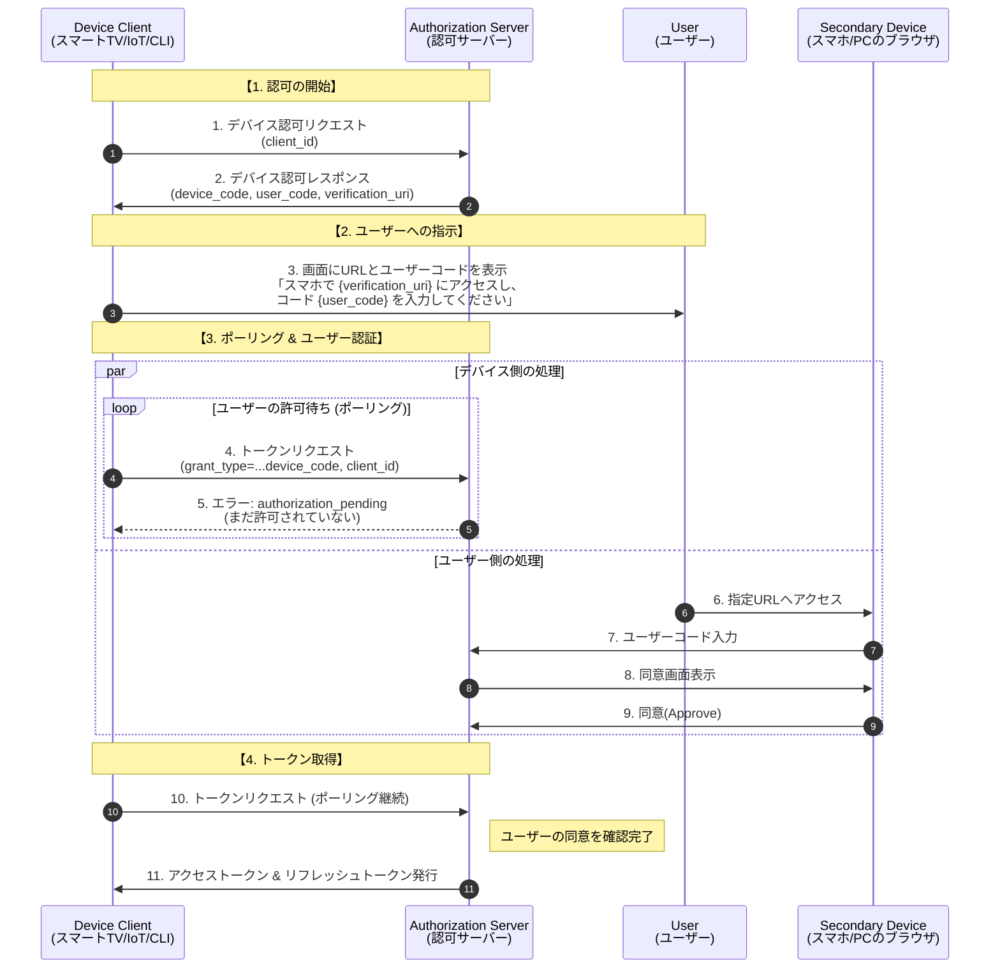

|            |                                                |
| ---------- | ---------------------------------------------- |
| grant_type | `urn:ietf:params:oauth:grant-type:device_code` |

## フロー

## 参照リンク
- https://qiita.com/TakahikoKawasaki/items/78eff94cef92741131f0
- https://tex2e.github.io/rfc-translater/html/rfc8628.html
- 