https://modelcontextprotocol.io/specification/2025-06-18/basic/authorization

> [!TIP] 前バージョンとの変更点
> とりあえず気づいたものを列挙
> 1. 構成要素として「認可サーバー」が新しく追加
> 	- 25年3月仕様ではMCPサーバーがホストしていたため同じドメインを使用できたが，見知らぬサードパーティの認可サーバーがホストできるようになったことから，認可サーバーを具体的に検出するフローが加えられた
> 	- ここで使われる仕様として，「OAuth 2.0 Protected Resource Metadata (RFC9728)」が採用されている
> 		- 新しく追加されたRFCはこれのみ
> 	- 

## 前提
- MCPにおいて，認証の実装はオプションとなる
- 認証機能を実装する場合
	- HTTP Transport に準拠する必要がある（**SHOULD**）
	- 一方，STDIO Transport を使用する場合はこの仕様に従わない（**SHOULD NOT**）
	- 代替のTransportを仕様する場合は，そのプロトコルのベストプラクティスに従う（**MUST**）

- 参照する標準は以下の通り

| フロー             | 標準                                                                                                                                     | 説明                                                                                                                                   |
| --------------- | -------------------------------------------------------------------------------------------------------------------------------------- | ------------------------------------------------------------------------------------------------------------------------------------ |
| 認可サーバーの場所の検出    | <u>OAuth 2.0 Protected Resource Metadata</u> ([RFC9728](https://datatracker.ietf.org/doc/html/rfc9728)new | MCPサーバー - 認可サーバーの位置を教えるため，実装する（**MUST**）                                                                                          |
| 認可サーバーのメタデータの検出 | <u>OAuth 2.0 Authorization Server Metadata </u>([RFC8414](https://datatracker.ietf.org/doc/html/rfc8414))                              | ~~認可サーバー - 実装すべき（**SHOULD**） - これをサポートしない認可サーバーは，デフォルトのURIスキーマに従う必要がある（**MUST**）~~  MCPクライアント - 実装しなくてはならない（**MUST**） |
| クライアント登録        | <u>OAuth 2.0 Dynamic Client Registration Protocol</u> ([RFC7591](https://datatracker.ietf.org/doc/html/rfc7591))                       | MCPサーバー - サポートすべき（**SHOULD**）  認可サーバー - サポートすべき（**SHOULD**）                                                              |
| トークン発行・使用       | <u>OAuth 2.1 IETF DRAFT</u> ([draft-ietf-oauth-v2-1-13](https://datatracker.ietf.org/doc/html/draft-ietf-oauth-v2-1-13))               | ~~機密クライアントとパブリッククライアントの両方に対して，適切なOAuth2.1を実装する必要がある（**MUST**）~~ 認可サーバー - OAuth2.1を実装する必要がある（**MUST**）                          |

## 登場人物
 - MCPサーバー
	- OAuth リソースサーバーとして機能
	- アクセストークンを利用し，保護されたリソースへのリソースを受け付ける
- MCPクライアント
	- OAuth クライアントとして機能
	- リソースオーナーに代わってリソースアクセスへの要求リクエストを行う
- 認可サーバー
	- MCPサーバーにて使用するアクセストークンを発行
	- 認可サーバーの実装の詳細はこの仕様の範囲外
	- リソースサーバーにホストされることもあるし，別のエンティティがホストすることもある
		- 認可サーバーのディスカバリフェーズにて，対応する認可サーバーの位置をクライアント側に示す

## 概要
- 認可サーバーは，機密クライアントおよびパブリッククライアントの双方に対して，適切なセキュリティ対策を備えたOAuth2.1を実装する必要がある（**MUST**）
- 認可サーバーとMCPクライアントは動的クライアント登録をサポートすべき（**SHOULD**）
- MCPサーバーは保護リソースメタデータ（RFC9728）を実装する必要がある（**MUST**）
	- また，MCPクライアントは認可サーバーのディスカバリに，この仕様を使う必要がある（**MUST**）
- 認可サーバーはOAuth認可サーバーメタデータ（RFC8414）を提供する必要がある（**MUST**）
	- また，MCPクライアントはこの仕様を使用する必要がある（**MUST**）

## 認可フロー
### 1. 認可サーバーの位置のディスカバリ
- 認可サーバーをディスカバリ（検出）するための仕様は基本的に「OAuth 2.0 Protected Resource Metadata (RFC9728)」に準じている印象

- MCPサーバーは認可サーバーの位置を教えるため，保護リソースメタデータ (RFC9728) を実装する（**MUST**）
	- また，このメタデータドキュメントには，少なくとも１つの `authorization_servers`フィールドが含まれている必要がある（**MUST**）
	- なお，このフィールドの具体的な使用方法についてはこの仕様の範囲外
		- 必要に応じて，実装する開発者は 保護リソースメタデータ仕様（RFC9728）を参照する
		- また，上記仕様には複数の認可サーバーが定義できることにも留意する
			- どの認可サーバーを使うかの責任は， RFC9728 Section7.6 に記載があるガイドラインに従う形で，MCPクライアントにある
- MCPサーバーは RFC9728 Section 5.1 にて記載のある，`WWW-Authenticate` ヘッダーを使用してレスポンスを行う必要がある（**MCP**）
	- MCPクライアントはこのヘッダーに対して適切に応答できる必要がある（**MUST**）

### 2. 認可サーバーの情報のディスカバリ
- MCPクライアントは認可サーバーと対話するために必要な情報を取得するため，OAuth 2.0 Authorization Server Metadata ([RFC8414](https://datatracker.ietf.org/doc/html/rfc8414)) に従う必要がある（**MUST**）

### 3. クライアント登録
- MCPクライアントと認可サーバーは動的クライアント登録 (以下DCR) をサポートすべき（**SHOULD**）
- 以下の理由により，MCPではDCRが重要
	- クライアントは，すべてのMCPサーバーと認可サーバーを事前に把握していない可能性がある
	- 静的登録（手動）はユーザーにとって煩わしい
	- 新しいMCPサーバーへの接続をシームレスに実現
	- 認可サーバーは独自の登録ポリシーを実装可能

- DCRをサポートしていない認可サーバーは，client_id（およびclient_secret）を取得するための代替手段を提供する必要がある
	- この場合，以下のどちらかになる
		1. 認可サーバーと対話する際に使用するclient_idをハードコードする
		2. ユーザーが自分でOAuthクライアント登録を行い，これらの詳細を入力できるUIを提示する

## 全体フロー

```mermaid
sequenceDiagram
    participant Client
    participant RS as MCP Server (Resource Server)
    participant AS as Authorization Server

    Client->>RS: MCP request without token
    RS-->>Client: HTTP 401 Unauthorized with WWW-Authenticate header

    Note over Client: Extract resource_metadata<br/>from WWW-Authenticate

    Client->>RS: GET /.well-known/oauth-protected-resource
    RS-->>Client: Resource metadata with authorization server URL

    Note over Client: Validate RS metadata,<br/>build AS metadata URL

    Client->>AS: GET /.well-known/oauth-authorization-server
    AS-->>Client: Authorization server metadata

    rect rgb(60, 60, 60)
        Note over Client, AS: OAuth 2.1 authorization flow happens here
    end

    Client->>AS: Token request
    AS-->>Client: Access token

    Client->>RS: MCP request with access token
    RS-->>Client: MCP response

    rect rgb(60, 60, 60)
        Note over Client, RS: MCP communication continues with valid token
    end
```

## 参照リンク
- 
