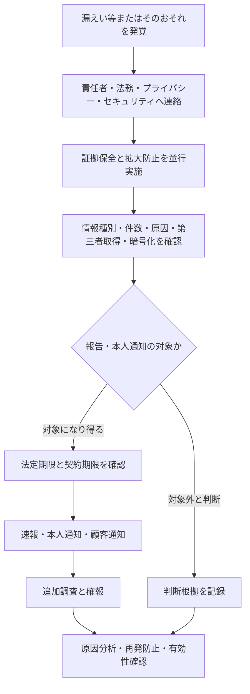

## 概要

個人情報の保護に関する法律（個人情報保護法、APPI）は、日本における個人情報の取扱いを定める。
セキュリティ担当者は、個人データの所在、アクセス、委託、越境、漏えい対応を法務・プライバシー担当と
連携して管理する。

## 用語を区別する

| 用語                   | 概要                                                               |
| ---------------------- | ------------------------------------------------------------------ |
| 個人情報               | 生存する個人に関する情報で、特定の個人を識別できるものなど         |
| 個人識別符号           | 身体的特徴を変換した符号や公的番号など、法令で定めるもの           |
| 要配慮個人情報         | 病歴、診療情報、犯罪歴など、特に配慮を要する情報                   |
| 個人情報データベース等 | 個人情報を検索できるよう体系的に構成したもの                       |
| 個人データ             | 個人情報データベース等を構成する個人情報                           |
| 保有個人データ         | 開示、訂正、利用停止などの権限を持つ個人データ                     |
| 個人関連情報           | 個人情報・仮名加工情報・匿名加工情報に当たらない、個人に関する情報 |

義務によって対象用語が異なるため、「個人情報」という一語で全てを処理しない。

## 取扱いの基本

- 利用目的をできる限り特定し、その範囲を超える利用を管理する
- 適正に取得し、必要な通知・公表を行う
- データ内容を正確かつ最新に保ち、不要になった場合の消去に努める
- 必要かつ適切な安全管理措置を講じる
- 従業者と委託先を必要かつ適切に監督する
- 第三者提供、外国にある第三者への提供、共同利用の要件を確認する
- 本人からの開示、訂正、利用停止などへ対応する

## 安全管理措置

個人情報保護委員会のガイドラインは、次の観点を示している。

- 基本方針と取扱規程
- 組織的安全管理措置
- 人的安全管理措置
- 物理的安全管理措置
- 技術的安全管理措置
- 外的環境の把握

技術的措置だけでなく、責任者、報告連絡体制、自己点検、教育、委託先監督、外国での取扱環境などを含む。

## 委託とクラウド

委託先選定、契約、取扱状況の把握を通じて、委託元は必要かつ適切な監督を行う。クラウドサービス利用では、
事業者がデータを取り扱うか、保存国、再委託、アクセス制御、ログ、削除、インシデント通知を確認する。

第三者提供と委託は法的な扱いが異なる。サービス名だけで決めず、契約と実際のデータ処理を確認する。

## 漏えい等の報告・本人通知

次のような個人データの漏えい、滅失、毀損、またはそのおそれは、個人情報保護委員会への報告と本人通知の
対象になり得る。

1. 要配慮個人情報を含む
2. 不正利用により財産的被害が生じるおそれがある
3. 不正の目的で行われたおそれがある行為に起因する
4. 本人の数が1,000人を超える

公式案内では、速報は発覚から概ね3〜5日以内、確報は原則30日以内、不正目的のおそれがある場合は
60日以内とされる。暗号化などによる例外、報告主体、認定団体や分野別当局、本人通知の代替措置を含め、
必ず最新ガイドラインで判断する。

## インシデント時の初動

1. 責任者、法務、プライバシー、セキュリティへ直ちに連絡する
2. 証拠を保全しつつ、認証情報の失効や公開停止などで拡大を防ぐ
3. 情報種別、本人件数、原因、第三者取得、暗号化状態を確認する
4. 報告・通知義務と契約上の期限を並行して判定する
5. 速報、確報、本人通知、顧客通知の意思決定を記録する
6. 原因分析、再発防止、有効性確認まで追跡する

## 関連制度

[[security/compliance/privacy-mark|プライバシーマーク]] は、JIS Q 15001 に基づく民間の制度であり、個人情報保護法そのものや
行政上の適法性判断を置き換えない。[[security/compliance/iso-iec-27701|ISO/IEC 27701]] は PIMS の国際規格である。

## 参照リンク

- [個人情報保護法ガイドライン（通則編）](https://www.ppc.go.jp/personalinfo/legal/guidelines_tsusoku/)
- [漏えい等の対応とお役立ち資料](https://www.ppc.go.jp/personalinfo/legal/leakAction/)
- [特定分野ガイドライン](https://www.ppc.go.jp/personalinfo/legal/guidelines/)
