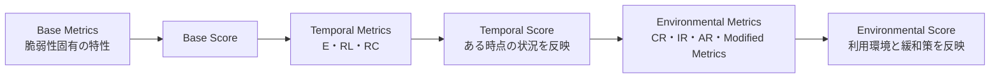
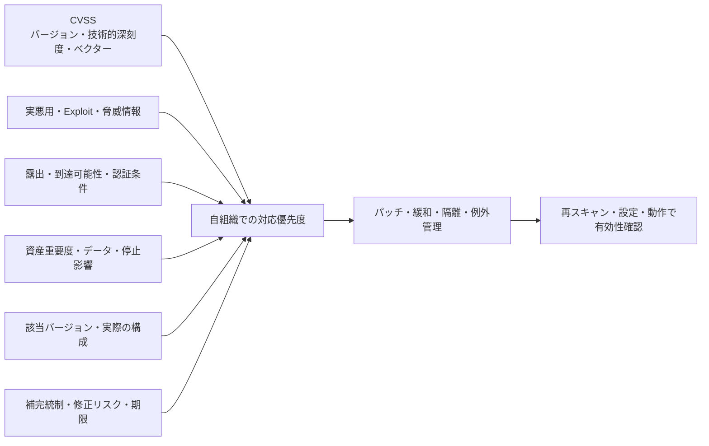

## 概要

CVSS（Common Vulnerability Scoring System）は、脆弱性の技術的な特性と深刻度を、ベンダーに依存しない
共通形式で評価・伝達するためのオープンな枠組みである。FIRST が仕様を管理する。

IPA は CVSS v3 の利点を、脆弱性を同じ基準で定量比較し、ベンダー、専門家、管理者、利用者が共通の言葉で
議論できることと説明している。2026年7月2日時点の現行仕様は CVSS v4.0 だが、脆弱性情報やツールでは
v3.1 も広く残っている。

CVSS の0.0〜10.0は Severity（深刻度）を表す。自社における Risk（リスク）や修正期限を、Base Score
だけで決めるものではない。

## バージョンを最初に確認する

v3.1 と v4.0 は指標と計算方法が異なるため、スコアだけを直接比較しない。

| 観点             | CVSS v3.1                            | CVSS v4.0                                             |
| ---------------- | ------------------------------------ | ----------------------------------------------------- |
| 指標グループ     | Base、Temporal、Environmental        | Base、Threat、Environmental、Supplemental             |
| 攻撃成立条件     | AV、AC、PR、UI                       | AV、AC、AT、PR、UI                                    |
| 影響範囲         | Scope で変更の有無を表す             | Vulnerable System と Subsequent System の影響を分ける |
| 時間変化         | E、RL、RC を Temporal Metrics で扱う | Exploit Maturity（E）を Threat Metrics で扱う         |
| スコア外の補足   | 独立したグループはない               | Safety、Automatable、Recovery などを伝達できる        |
| ベクターの接頭辞 | `CVSS:3.1/`                          | `CVSS:4.0/`                                           |

古い情報には v3.0 もある。チケットや資産台帳には、数値だけでなくバージョンとベクター文字列を保存する。

## CVSS v3の3つの評価基準

IPA の解説では、v3 の評価を次の3段階に分けている。

| 評価基準                              | 評価する内容                                     | 主な評価者・用途                       |
| ------------------------------------- | ------------------------------------------------ | -------------------------------------- |
| 基本評価基準（Base Metrics）          | 時間や利用環境で変化しない、脆弱性そのものの特性 | ベンダーや公表組織が固有の深刻度を示す |
| 現状評価基準（Temporal Metrics）      | 攻撃コードや対策の利用可能性など、現在の状況     | 時間とともに変わる現状の深刻度を示す   |
| 環境評価基準（Environmental Metrics） | 利用者の環境、資産の重要度、緩和策を反映した影響 | 利用者が自組織での対応を判断する       |

### v3のBase Metrics

攻撃の難易度と、攻撃が成功した場合の影響を分けて評価する。

- **Attack Vector（AV、攻撃元区分）**: Network、Adjacent、Local、Physical
- **Attack Complexity（AC、攻撃条件の複雑さ）**: 攻撃成立に必要な条件の複雑さ
- **Privileges Required（PR、必要な特権レベル）**: 攻撃前に必要な権限
- **User Interaction（UI、ユーザ関与レベル）**: 攻撃成立に利用者の操作が必要か
- **Scope（S、スコープ）**: 影響が同じ認可範囲に留まるか、別の認可範囲へ広がるか
- **Confidentiality、Integrity、Availability（C、I、A）**: 機密性、完全性、可用性への直接的な影響

Scope は「別のホストへ影響したか」ではなく、管理権限の範囲である Authorization Scope が変わるかで
判断する。同じホスト内でも別の認可範囲へ影響すれば Scope Changed になり得る。

### v3のTemporal MetricsとEnvironmental Metrics

Temporal Metrics は次の3項目で、時間の経過とともに値が変わり得る。

- **Exploit Code Maturity（E）**: 攻撃コードや攻撃手法が利用可能か
- **Remediation Level（RL）**: 公式修正、暫定修正、回避策などが利用可能か
- **Report Confidence（RC）**: 脆弱性情報や技術的詳細の信頼性

Environmental Metrics では、機密性・完全性・可用性の要求度（CR、IR、AR）と、実環境に合わせて
再評価した Modified Metrics を使う。例えばファイアウォールなどの緩和策で到達可能性が変わる場合は、
Modified Attack Vector（MAV）などへ反映する。

> [!note] IPAページの対象
> IPA の「共通脆弱性評価システムCVSS v3概説」は2022年4月5日最終更新の v3 解説である。
> v4.0 の指標名や計算方法の根拠には、FIRST の v4.0 仕様を使用する。

## CVSS v4.0の4つの指標グループ

| Group         | 役割                                                                   |
| ------------- | ---------------------------------------------------------------------- |
| Base          | 時間や利用環境に依存しない、脆弱性固有の攻撃容易性と影響               |
| Threat        | Exploit Maturity により、攻撃手法やコードの現在の成熟度を反映          |
| Environmental | 自組織の構成、緩和策、機密性・完全性・可用性の重要度を反映             |
| Supplemental  | Safety、Automatable、Recovery などの追加情報を伝える。スコアは変えない |

Supplemental Metrics には、Safety、Automatable、Provider Urgency、Recovery、Value Density、
Vulnerability Response Effort がある。スコアに含めず、対応判断の文脈として利用する。

### v4.0のBase Metrics

Exploitability Metrics は次の5項目である。

- Attack Vector（AV）: Network、Adjacent、Local、Physical
- Attack Complexity（AC）: 攻撃時に回避すべき技術的条件
- Attack Requirements（AT）: 攻撃成立に必要な前提条件
- Privileges Required（PR）: 攻撃前に必要な権限
- User Interaction（UI）: 利用者の操作が必要か

Impact Metrics は、脆弱性が存在する Vulnerable System の C・I・A（VC、VI、VA）と、その外側にある
Subsequent System の C・I・A（SC、SI、SA）を分けて評価する。v3.1 の Scope をそのまま v4.0 へ
読み替えない。

## スコアとベクター

| Rating   | Score     |
| -------- | --------- |
| None     | 0.0       |
| Low      | 0.1〜3.9  |
| Medium   | 4.0〜6.9  |
| High     | 7.0〜8.9  |
| Critical | 9.0〜10.0 |

数値だけでなくベクター文字列を保存する。例えば、スコアが同じでも、ネットワーク経由で認証不要の脆弱性と、
物理アクセスが必要な脆弱性では対応が異なる。ベクターがあれば評価根拠を読み直せる。

Base、Threat、Environmental など、どこまで評価したスコアかも明記する。ベンダーの Base Score と
自社で再評価した Environmental Score を、同じ前提の数値として比較しない。

## CVSSで分かること・分からないこと

| CVSSで表現できること                           | CVSSだけでは決まらないこと                       |
| ---------------------------------------------- | ------------------------------------------------ |
| 攻撃経路、必要権限、利用者操作などの技術的条件 | 自社が実際に影響製品・バージョンを利用しているか |
| 機密性・完全性・可用性への技術的影響           | インターネットから実際に到達できるか             |
| 悪用成熟度や利用環境を反映した深刻度           | 資産の事業価値、停止損失、法令・契約上の期限     |
| 評価根拠を共有するベクター                     | パッチ適用による障害リスクや最適な対応方法       |

## 対応優先度の決め方

CVSS は Severity の入力であり、Risk の全体ではない。少なくとも次を組み合わせる。

- CISA Known Exploited Vulnerabilities（KEV）などの実悪用情報
- Exploit の公開・成熟度、攻撃観測、脅威インテリジェンス
- インターネット露出、到達可能性、認証・権限条件
- 対象資産の事業重要度、データ分類、停止影響
- 実際の製品バージョン・構成が影響を受けるか
- EDR、WAF、ネットワーク分離などの補完統制
- 修正による停止・互換性リスク、代替緩和策
- 法令、契約、SLA の期限

例として、CVSS 9.8 でも影響バージョンが存在しなければ対応対象外である。一方、CVSS 7.5 でも
実悪用され、外部公開された重要システムなら最優先になり得る。

## 運用フロー

1. CVE、製品、バージョン、CVSS バージョンとベクターを取得する
2. 資産台帳や [[security/compliance/sbom|SBOM]] と照合し、自社への該当性を判定する
3. v3 の Temporal / Environmental、または v4 の Threat / Environmental の再評価が必要か判断する
4. 悪用状況、露出、資産重要度、補完統制で優先順位を決める
5. パッチ、設定変更、隔離などの対応を決める
6. 例外は残留リスク、期限、承認者、再確認日を記録する
7. 修正後にバージョン、設定、スキャンなどで有効性を確認する

## よくある誤り

- ベンダーの Base Score をそのまま自社リスクとする
- CVSS のバージョンやベクターを記録しない
- v3 の Scope と v4 の Subsequent System Impact を同じ指標として読み替える
- v3 の Temporal Score と v4 の Threat Metrics を同じ構成だと考える
- スキャナーの検出結果を資産所有者・構成情報で検証しない
- パッチ適用をもって完了とし、再スキャンや動作確認をしない
- Critical だけを対応し、実悪用中の High 以下を見落とす

## 参照リンク

- [IPA: 共通脆弱性評価システムCVSS v3概説](https://www.ipa.go.jp/security/vuln/scap/cvssv3.html)
- [FIRST CVSS v3.1](https://www.first.org/cvss/v3.1/)
- [FIRST CVSS v4.0](https://www.first.org/cvss/v4.0/)
- [CVSS v4.0 Specification](https://www.first.org/cvss/specification-document)
- [CVSS v4.0 Calculator](https://www.first.org/cvss/calculator/v4-0)
- [CISA Known Exploited Vulnerabilities Catalog](https://www.cisa.gov/known-exploited-vulnerabilities-catalog)
