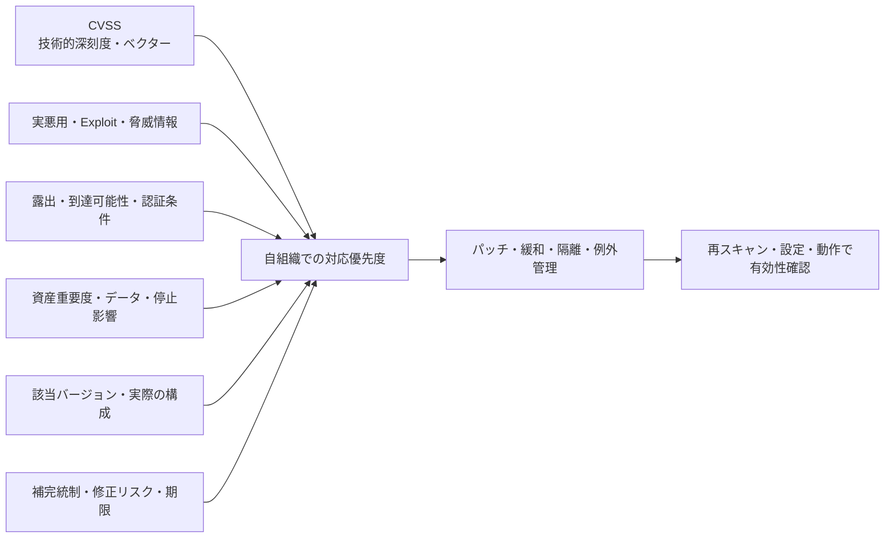

## 概要

CVSS（Common Vulnerability Scoring System）は、ソフトウェア、ハードウェア、ファームウェアの
脆弱性が持つ技術的な特性と深刻度を共通形式で伝えるためのオープンな枠組みである。FIRST が管理する。

2026年7月1日時点の現行仕様は CVSS v4.0。スコアは0.0〜10.0だが、事業リスクや修正期限を単独で
決める数値ではない。

## 4つの指標グループ

| Group         | 役割                                                                 |
| ------------- | -------------------------------------------------------------------- |
| Base          | 時間や利用環境に依存しない、脆弱性固有の技術特性                     |
| Threat        | 悪用の成熟度など、時間とともに変わる脅威特性                         |
| Environmental | 自組織の構成、補完統制、機密性・完全性・可用性の重要度               |
| Supplemental  | Safety、Automatable、Recovery などの追加情報。スコア自体は変更しない |

CVSS v3.1 の Temporal は、v4.0 では Threat に整理された。古いツールや脆弱性情報は v3.1 を使うため、
スコアと一緒に CVSS のバージョンを記録する。

## Base Metricsの要点

### Exploitability

- Attack Vector（AV）: Network、Adjacent、Local、Physical
- Attack Complexity（AC）: 攻撃時に回避すべき技術的条件
- Attack Requirements（AT）: 攻撃成立に必要な前提条件
- Privileges Required（PR）: 攻撃前に必要な権限
- User Interaction（UI）: 利用者の操作が必要か

### Impact

Vulnerable System と Subsequent System を分けて、Confidentiality、Integrity、Availability への影響を
評価する。v3.1 の Scope をそのまま v4.0 へ読み替えない。

## スコアとベクター

| Rating   | Score     |
| -------- | --------- |
| None     | 0.0       |
| Low      | 0.1〜3.9  |
| Medium   | 4.0〜6.9  |
| High     | 7.0〜8.9  |
| Critical | 9.0〜10.0 |

数値だけでなくベクター文字列を保存する。例えば、スコアが同じでも、ネットワーク経由で認証不要の脆弱性と、
物理アクセスが必要な脆弱性では対応が異なる。ベクターがあれば評価根拠を読み直せる。

## 対応優先度の決め方

CVSS は Severity の入力であり、Risk の全体ではない。少なくとも次を組み合わせる。

- CISA Known Exploited Vulnerabilities（KEV）などの実悪用情報
- Exploit の公開・成熟度、攻撃観測、脅威インテリジェンス
- インターネット露出、到達可能性、認証・権限条件
- 対象資産の事業重要度、データ分類、停止影響
- 実際の製品バージョン・構成が影響を受けるか
- EDR、WAF、ネットワーク分離などの補完統制
- 修正による停止・互換性リスク、代替緩和策
- 法令、契約、SLA の期限

例として、CVSS 9.8 でも影響バージョンが存在しなければ対応対象外である。一方、CVSS 7.5 でも
実悪用され、外部公開された重要システムなら最優先になり得る。

## 運用フロー

1. CVE、製品、バージョン、CVSS バージョンとベクターを取得する
2. 資産台帳や [[security/compliance/sbom|SBOM]] と照合し、自社への該当性を判定する
3. 悪用状況、露出、資産重要度、補完統制で優先順位を決める
4. パッチ、設定変更、隔離などの対応を決める
5. 例外は残留リスク、期限、承認者、再確認日を記録する
6. 修正後にバージョン、設定、スキャンなどで有効性を確認する

## よくある誤り

- ベンダーの Base Score をそのまま自社リスクとする
- CVSS のバージョンやベクターを記録しない
- スキャナーの検出結果を資産所有者・構成情報で検証しない
- パッチ適用をもって完了とし、再スキャンや動作確認をしない
- Critical だけを対応し、実悪用中の High 以下を見落とす

## 参照リンク

- [FIRST CVSS v4.0](https://www.first.org/cvss/v4.0/)
- [CVSS v4.0 Specification](https://www.first.org/cvss/specification-document)
- [CVSS v4.0 Calculator](https://www.first.org/cvss/calculator/v4-0)
- [CISA Known Exploited Vulnerabilities Catalog](https://www.cisa.gov/known-exploited-vulnerabilities-catalog)
