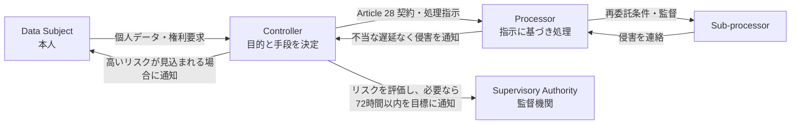

## 概要

GDPR（General Data Protection Regulation、Regulation (EU) 2016/679）は、EU の個人データ処理を
規律する法令である。プライバシー文書を置くだけの要求ではなく、データのライフサイクル全体に対する
説明責任、本人の権利、技術的・組織的措置を求める。

## 域外適用

EU 域内に拠点がなくても、EU 域内の本人へ商品・サービスを提供する場合や、EU 域内における行動を
監視する場合などに適用されることがある。Web サイトが EU から閲覧可能という事実だけで決めず、
事業活動、対象者、追跡の目的を確認する。

## 主な役割

- **Data Subject**: 個人データに関係する本人
- **Controller**: 処理の目的と手段を決める者
- **Processor**: Controller のために指示に基づいて処理する者
- **Sub-processor**: Processor が利用する再委託先
- **Supervisory Authority**: 監督機関
- **DPO**: 一定の場合に選任される Data Protection Officer

クラウド事業者が常に Processor とは限らない。処理目的ごとに役割を判断し、Controller と Processor の
関係では Article 28 の要求を満たす契約を整える。

## 7つの基本原則

1. 適法性、公平性、透明性
2. 目的制限
3. データ最小化
4. 正確性
5. 保存期間の制限
6. 完全性と機密性
7. 説明責任

## 適法化根拠

個人データ処理には、同意、契約の履行、法的義務、重大な利益、公共の利益・公的権限、正当な利益など、
適切な法的根拠が必要である。「同意を取れば何でもよい」わけではなく、目的と関係に合う根拠を選ぶ。
特別カテゴリーのデータには追加条件がある。

## セキュリティ担当が関わる事項

- データ処理記録とデータフロー
- Privacy by Design / by Default
- リスクに応じた暗号化、仮名化、アクセス制御、可用性、復旧、定期評価
- Processor と Sub-processor のセキュリティ評価・契約・監督
- 高リスク処理に対する Data Protection Impact Assessment（DPIA）
- 本人のアクセス、削除、訂正、制限、異議、データポータビリティへの対応
- EU/EEA 域外移転の法的手段と追加保護措置
- 侵害検知、評価、記録、通知

## 個人データ侵害

Controller は、個人の権利と自由へのリスクが生じる可能性が低い場合を除き、侵害を認識してから
不当な遅延なく、可能であれば72時間以内に監督機関へ通知する。Processor は侵害を認識したら
不当な遅延なく Controller へ通知する。

本人への高いリスクが見込まれる場合は、原則として本人にも不当な遅延なく通知する。72時間は調査完了の
猶予ではないため、段階的報告、意思決定記録、契約上のより短い通知期限を手順へ組み込む。

## よくある誤解

- 個人データは氏名だけでなく、オンライン識別子や組合せで識別できる情報を含み得る
- 匿名化と仮名化は同じではなく、仮名化データは原則として GDPR の対象である
- ISO/IEC 27001 認証だけで GDPR 遵守が自動的に証明されるわけではない
- Controller と Processor の責任を契約で全て相手へ移せるわけではない

## 参照リンク

- [Regulation (EU) 2016/679](https://eur-lex.europa.eu/legal-content/EN/TXT/?uri=CELEX:32016R0679)
- [EU Commission: Data protection](https://commission.europa.eu/law/law-topic/data-protection_en)
