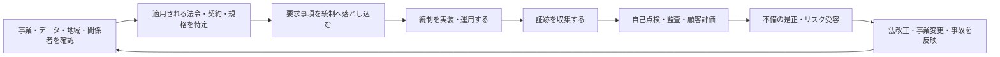

このフォルダーは、入社直後のセキュリティ担当者が「制度の名前を知っている」状態から、
適用範囲を判断し、必要な統制と証跡を関係者に説明できる状態になるためのメモである。

> [!important] 利用上の注意
> 法令、契約、認証基準は改定される。実案件では、各記事の公式リンクから現行版と適用日を
> 確認し、法務、プライバシー、監査などの責任部署に判断を確認すること。このページは法的助言ではない。

## 学習と実務の全体像

制度名を覚えることが目的ではない。適用範囲を起点に、要求、統制、証跡、評価をつなげて考える。

## 最初に読むページ

1. [[security/compliance/security-compliance-basics|セキュリティ・コンプライアンスの基礎]]
   - 法令、規格、認証、保証報告書、フレームワークの違いを理解する
2. [[security/compliance/security-controls-and-evidence|セキュリティ統制と証跡]]
   - 要求事項を、実装、運用、証跡、評価へ落とし込む
3. [[security/compliance/nist-csf|NIST Cybersecurity Framework]]
   - セキュリティ活動の全体像を6つの機能で捉える
4. [[security/compliance/cis-controls|CIS Controls]]
   - 初学者が着手しやすい、優先順位付きの具体策を知る

## 制度の見取り図

<!-- prettier-ignore -->
| 分類 | 代表例 | 主な問い |
| --- | --- | --- |
| 法令・規則 | [[security/compliance/appi|個人情報保護法]]、[[security/compliance/gdpr|GDPR]]、[[security/compliance/hipaa|HIPAA]] | 自社のどの処理に法的義務が生じるか |
| マネジメントシステム規格 | [[security/compliance/iso-iec-27001|ISO/IEC 27001]]、[[security/compliance/iso-iec-27701|ISO/IEC 27701]] | リスクを継続的に管理する仕組みがあるか |
| 管理策・実装ガイダンス | [[security/compliance/iso-iec-27017|ISO/IEC 27017]]、[[security/compliance/nist-sp-800-53|NIST SP 800-53]] | どの統制を、誰が、どのように実施するか |
| 政府クラウド評価制度 | [[security/compliance/ismap|ISMAP]]、[[security/compliance/fedramp|FedRAMP]] | 政府機関がクラウドを調達できる状態か |
| 製品・暗号モジュールの規格 | [[security/compliance/fips|FIPS、特に FIPS 140-3]] | 指定された暗号方式・検証済みモジュールを使っているか |
| 業界標準 | [[security/compliance/pci-dss|PCI DSS]] | 決済カードのアカウントデータを保護できているか |
| 保証報告書 | [[security/compliance/soc2|SOC 2]] | 対象期間中にサービス組織の統制が有効だったか |
| 国内の認証制度 | [[security/compliance/privacy-mark|プライバシーマーク]] | 個人情報保護マネジメントシステムを運用しているか |
| 運用・技術 | [[security/compliance/cvss|CVSS]]、[[security/compliance/sbom|SBOM]]、[[security/compliance/pqc-alg|PQC]] | 脆弱性・供給網・暗号移行をどう管理するか |

## 業務別の読み順

### 顧客質問票や監査対応

1. [[security/compliance/security-compliance-basics|適用範囲と用語]]
2. [[security/compliance/security-controls-and-evidence|統制、証跡、例外管理]]
3. [[security/compliance/iso-iec-27001|ISO/IEC 27001]] と [[security/compliance/soc2|SOC 2]]
4. 顧客の業界に応じて [[security/compliance/pci-dss|PCI DSS]]、[[security/compliance/hipaa|HIPAA]]、[[security/compliance/gdpr|GDPR]] を確認する

### クラウドサービスの設計・調達

1. [[security/compliance/iso-iec-27017|ISO/IEC 27017]]
2. [[security/compliance/ismap|ISMAP]] または [[security/compliance/fedramp|FedRAMP]]
3. [[security/compliance/fips|FIPS 140-3]] とクラウド事業者の責任共有モデル
4. [[security/compliance/soc2|SOC 2]] の対象範囲、例外、補完的利用者企業統制を確認する

### 脆弱性・ソフトウェア供給網

1. [[security/compliance/cvss|CVSS]] で技術的深刻度を読む
2. 資産重要度、悪用実績、露出、補完統制を加えて対応優先度を決める
3. [[security/compliance/sbom|SBOM]] で利用コンポーネントを特定し、影響確認につなげる
4. [[security/compliance/pqc-alg|PQC]] を暗号資産棚卸しと長期移行計画に反映する

## 初学者が最初に確認する質問

- これは法令、契約、規格、認証、監査報告書、ガイドラインのどれか
- 適用対象は組織、法人、サービス、システム、データ、地域のどれか
- 対象範囲と対象外範囲は文書化されているか
- 要求事項の責任者と実施者は誰か
- 実施した事実を示す証跡は何か、どの期間保存するか
- クラウド事業者、委託先、自社、顧客の責任分界はどこか
- 不適合や例外を誰が承認し、いつ見直すか
- インシデント時の報告先と期限は何か
- 現行版、移行期限、契約上の追加条件を確認したか
