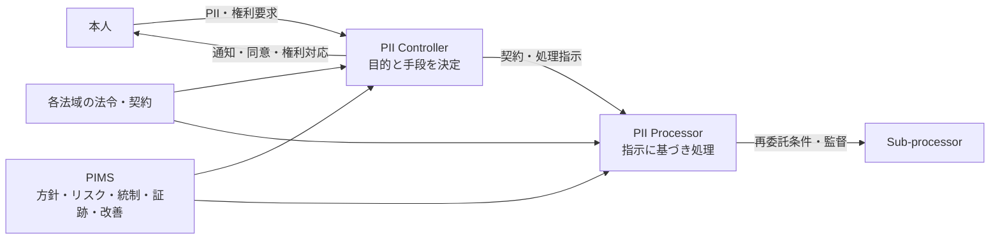

## 概要

ISO/IEC 27701 は、Privacy Information Management System（PIMS）を確立、実施、維持し、継続的に
改善するための要求事項とガイダンスを定める国際規格である。

2026年7月1日時点の現行版は ISO/IEC 27701:2025（第2版）で、ISO/IEC 27701:2019 は廃止されている。
2025年版は単独で利用できるマネジメントシステム規格となり、ISO/IEC 27001 との整合も考慮されている。

## 対象となる役割

- **PII Controller**: PII 処理の目的と手段を決める組織
- **PII Processor**: Controller のために PII を処理する組織

同じ組織でも、サービスや処理目的によって Controller と Processor の両方になり得る。役割を契約名称だけで
決めず、実際に誰が目的・手段を決めるかを確認する。

## PIMSで管理する内容

- 組織の状況、利害関係者、PIMS の適用範囲
- プライバシー方針、役割、責任
- PII 処理とプライバシーリスクの評価
- 収集、利用、開示、保存、削除のルール
- 本人への通知、同意、権利要求への対応
- Privacy by Design / by Default
- 委託先、再委託、契約、越境移転
- インシデントと個人データ侵害への対応
- 内部監査、マネジメントレビュー、是正、継続的改善

## 法令との関係

ISO/IEC 27701 は、[[security/compliance/gdpr|GDPR]] や [[security/compliance/appi|個人情報保護法]] そのものではない。PIMS は複数法域の要求を
組織的に管理し、説明責任を示す助けになるが、適法性は対象地域、データ、目的、契約、当局解釈に基づいて
別途判断する。

規格の PII、GDPR の personal data、日本法の個人情報・個人データは、それぞれ定義と義務が異なる。

## 初学者の実務チェック

1. PII 処理の一覧とデータフローを作る
2. 処理ごとに Controller / Processor、目的、法的根拠、保存期間を確認する
3. 本人への表示と実際の処理を一致させる
4. 委託先、再委託先、保存国、移転根拠を管理する
5. 権利要求と侵害通知の期限を手順・演習へ反映する
6. PIMS の適用範囲、リスク、統制、証跡を定期的に見直す

## 2019年版からの移行

2019年版を前提にした認証、契約、社内規程がある場合は、認証機関や顧客と移行期限・差分を確認する。
「ISO/IEC 27001 の拡張」という旧版の説明を、そのまま2025年版の説明として使わない。

## 参照リンク

- [ISO/IEC 27701:2025](https://www.iso.org/standard/27701)
