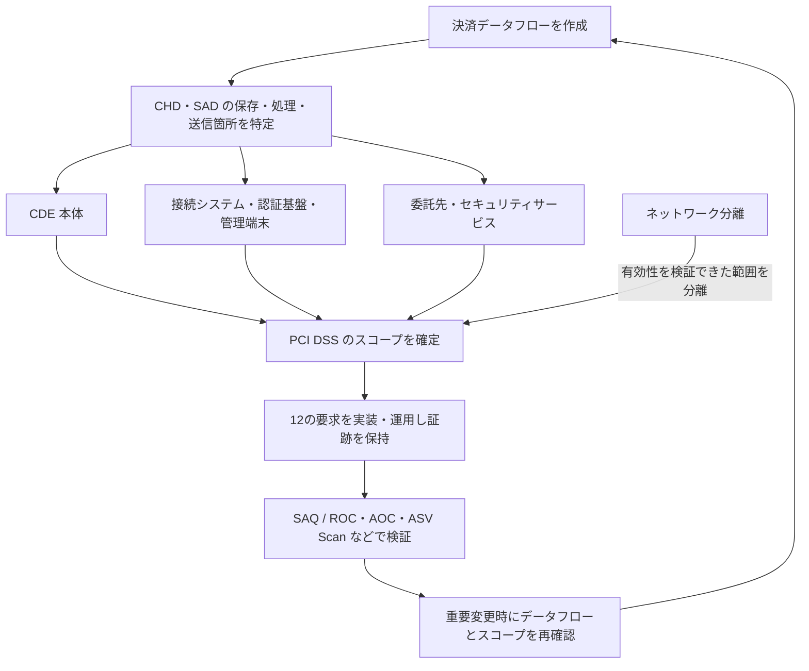

## 概要

PCI DSS（Payment Card Industry Data Security Standard）は、カード会員データや機微な認証データを
保護するための技術的・運用上の要求事項を定めた世界共通の業界標準である。

法律ではないが、国際カードブランド、アクワイアラー、契約などを通じて加盟店やサービスプロバイダーに
遵守・検証が求められる。2026年7月1日時点の公開版は v4.0.1 である。

## 適用対象とスコープ

カード会員データ（CHD）や機微な認証データ（SAD）を保存、処理、送信する、または Cardholder Data
Environment（CDE）のセキュリティへ影響し得る組織・システムが対象となる。

スコープには、CDE 本体だけでなく、接続システム、認証基盤、管理端末、セキュリティサービス、開発・運用、
委託先が入ることがある。ネットワーク分離はスコープを減らせるが、有効性の検証が必要である。

## 12の要求事項

1. ネットワークセキュリティ統制を導入・維持する
2. 全システムコンポーネントへセキュアな構成を適用する
3. 保存されたアカウントデータを保護する
4. オープンな公共ネットワーク上の通信を強力な暗号で保護する
5. 悪意あるソフトウェアからシステムとネットワークを保護する
6. セキュアなシステムとソフトウェアを開発・維持する
7. 業務上の必要性に基づいてアクセスを制限する
8. 利用者を識別し、システムコンポーネントへのアクセスを認証する
9. カード会員データへの物理アクセスを制限する
10. システムとカード会員データへのアクセスを記録・監視する
11. システムとネットワークのセキュリティを定期的にテストする
12. 組織の方針とプログラムで情報セキュリティを支える

正式な要求文、適用条件、テスト手順は原文を確認する。

## 準拠検証

- **SAQ**: 条件を満たす加盟店・サービスプロバイダーが行う自己評価質問票
- **ROC**: Qualified Security Assessor（QSA）などによる詳細な評価報告書
- **AOC**: 評価結果を表明する Attestation of Compliance
- **ASV Scan**: Approved Scanning Vendor による外部脆弱性スキャン

どの検証方法と頻度が必要かは、加盟店区分、取引量、サービスプロバイダー区分、カードブランドや
アクワイアラーの要求で決まる。PCI SSC が全組織へ一律に「認証」を付与する仕組みではない。

## v4.xで重視される点

- CDE へのアクセスに対する MFA の拡大
- パスワードだけに依存しない認証とアカウント管理
- E-commerce のスクリプト管理と改ざん検知
- Targeted Risk Analysis に基づく一部頻度の決定
- 定められた方法に加え、目的を満たす Customized Approach
- 継続的なスコープ確認とサービスプロバイダー管理

## 初学者の実務チェック

1. 決済データフローを描き、CHD と SAD の保存・処理・送信箇所を特定する
2. 不要な保存をやめる。認可後の SAD 保存禁止など、データ種別ごとの制約を確認する
3. CDE、接続システム、スコープ外を根拠付きで分類する
4. 委託先の PCI DSS 責任範囲と AOC を確認する
5. 各要求のオーナー、実装、証跡、評価頻度を決める
6. 重要変更後にもスコープと統制を見直す

トークン化や外部決済画面を使っても、自社の責任が必ずゼロになるわけではない。実装方式と SAQ の
適格条件を確認する。

## 参照リンク

- [PCI Data Security Standard](https://www.pcisecuritystandards.org/standards/pci-dss/)
- [PCI SSC Document Library](https://www.pcisecuritystandards.org/document_library/)
