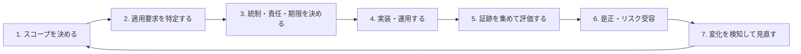

## コンプライアンスとは

コンプライアンスは、単に「認証を取ること」ではない。組織に適用される法令、規制、契約、
社内規程などの義務を把握し、それを守り、守っていることを説明できる状態を継続することである。

セキュリティは、機密性、完全性、可用性などのリスクを管理する活動である。コンプライアンスは
最低限の要求や説明責任を示すが、要求を満たしただけで全ての攻撃を防げるわけではない。

## 用語の違い

| 用語                 | 意味                                           | 例                                         |
| -------------------- | ---------------------------------------------- | ------------------------------------------ |
| 法令・規則           | 国や地域が定める強制力のあるルール             | 個人情報保護法、GDPR、HIPAA Rules          |
| 契約要求             | 顧客、決済ブランド、委託元などとの合意         | セキュリティ条項、監査権、PCI DSS 準拠要求 |
| 規格・標準           | 共通の要求事項や方法を定めた文書               | ISO/IEC 27001、FIPS 140-3                  |
| 認証                 | 第三者が対象範囲について規格適合を証明する制度 | ISO/IEC 27001 認証、プライバシーマーク     |
| 保証・監査報告書     | 独立した専門家が統制を評価した報告             | SOC 2 Type 2                               |
| フレームワーク       | リスク管理の考え方や成果を整理した枠組み       | NIST CSF                                   |
| コントロールカタログ | 実装候補となる管理策の集合                     | NIST SP 800-53、CIS Controls               |
| ガイダンス           | 実施方法や解釈を補助する文書                   | 当局ガイドライン、実装ガイド               |

「認証済み」「準拠」「適合」「検証済み」「監査済み」は同義ではない。誰が、何を、どの基準で、
どの期間評価したかまで確認する。

## 適用範囲を決める5つの軸

1. **主体**: どの法人、部門、サービス、委託先が対象か
2. **地域**: 事業所だけでなく、本人の居住地やサービス提供地域が条件になるか
3. **データ**: 個人データ、ePHI、カード会員データ、政府情報などを扱うか
4. **行為**: 取得、保存、利用、提供、処理、送信、削除のどれを行うか
5. **関係**: 管理者・処理者、委託元・委託先、サービス提供者・利用者のどの立場か

適用判断は、制度名を検索して終わりではない。データフロー、資産台帳、契約、利用地域、委託先を
具体的に対応付け、判断根拠と判断日を残す。

## セキュリティリスクの基本語彙

- **資産**: 守る対象。情報、システム、サービス、人、評判など
- **脅威**: 損害を起こし得る原因。攻撃者、誤操作、災害など
- **脆弱性**: 脅威に悪用され得る弱点
- **影響**: 事象が起きた場合の損害
- **可能性**: 事象が起きる見込み
- **リスク**: 不確実性が目的に与える影響。実務では可能性と影響を使って評価することが多い
- **統制**: リスクを修正するための方針、手順、仕組み、技術
- **残留リスク**: 統制を適用した後に残るリスク

## 実務の基本サイクル

1. 対象サービス、データ、システム、関係者をスコープする
2. 適用される法令、契約、規格、社内規程を一覧化する
3. 要求事項を統制へ対応付け、責任者と期限を決める
4. 統制を実装し、運用手順と例外手順を整備する
5. 証跡を継続的に収集し、自己点検や独立評価を行う
6. 不備を是正し、残留リスクを権限者が受容する
7. 法改正、事業変更、インシデントを契機に見直す

## よくある誤解

- ISO/IEC 27001 認証があれば、全製品が安全という意味ではない
- SOC 2 は行政機関が付与するセキュリティ認証ではない
- FIPS に「対応したアルゴリズム」と、CMVP で検証された暗号モジュールは別物である
- クラウド事業者が認証済みでも、利用者側の設定や運用責任は残る
- CVSS の点数だけでは、自社環境における修正優先度は決まらない
- SBOM を生成しただけでは、脆弱性が修正されたことにはならない

## 関連メモ

- [[security/compliance/security-controls-and-evidence|セキュリティ統制と証跡]]
- [[security/compliance/index|セキュリティ・コンプライアンス入門]]
